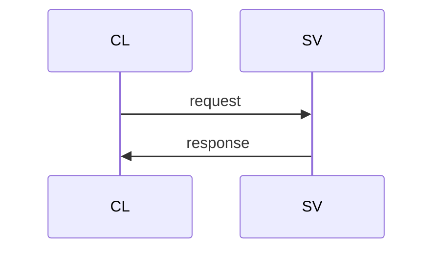
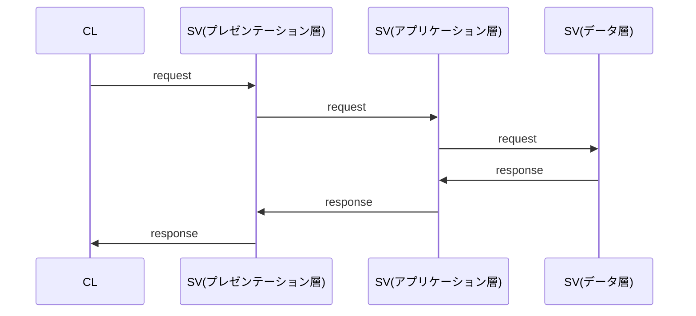
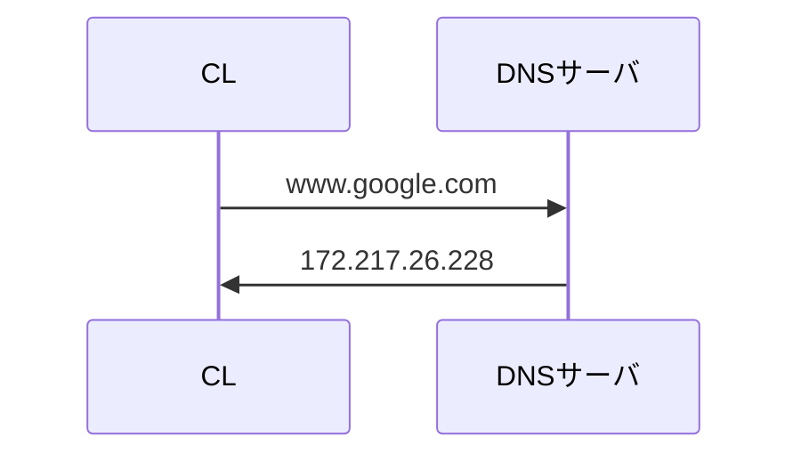

### クライアントサーバーシステム（CSS）

> クライアントサーバシステムとは、通信ネットワークを利用したコンピュータシステムの形態の一つで、機能や情報を提供する「サーバ」（server）と、利用者が操作する「クライアント」（client）をネットワークで結び、クライアントからの要求にサーバが応答する形で処理を進める方式。  
>> https://e-words.jp/w/%E3%82%AF%E3%83%A9%E3%82%A4%E3%82%A2%E3%83%B3%E3%83%88%E3%82%B5%E3%83%BC%E3%83%90%E3%82%B7%E3%82%B9%E3%83%86%E3%83%A0.html

> クライアントサーバシステムとは、システムの構築方法の分類の１つであり、サービス（実際の処理）を提供する「サーバ」と、サービスをリクエストする「クライアント」とで役割を分担したシステムのことです。
>> https://it-biz.online/it-skills/client-server/

メリット  
- 負荷分散
- 部分的な故障に強い
- システム変更に強い

---

### ３層アーキテクチャ
>> https://it-biz.online/it-skills/3-tier/

プレゼンテーション層  
ブラウザから受け取った閲覧要求をもとにページ情報を返す  
画面の表示処理に特化した階層？  

アプリケーション層  
プレゼンテーション層に入力された値をもとに、何かしらの処理を行う役割を担う。  

データ層  
ページ情報をはじめ、サイトの構造や画像、その他あらゆる情報が詰め込まれている。  

---

### ドメインとIPアドレス
>> https://www.nic.ad.jp/sc-nagoya/sc-program/day1-kadokura.pdf

- ドメイン名(ユーザーが利用する方)  
  - 人がインターネット上、通信先を指定するうえで利用される識別子  
    (webサイトのURLや、電子メールアドレスなどに使われる)  

- IPアドレス(コンピュータが解釈する方)
  - コンピュータやルータなどの端末がインターネット上、通信元の各ににゃ通信先を指定するうえで利用される識別子  
    (コンピュータやルータ等のネットワーク機器に付与されている)

- DNS(Domain Name System)
  - ドメイン名とIPアドレスの変換を行うために使われている仕組み
  

---

### プロトコル
通信プロトコル  
両者間の取り決め、約束事を意味するもの  
多くのプロトコルはIETF(インターネット技術特別調査委員会)によって定められている

- HTTP  
> HTTP (HyperText Transfer Protocol) は、WebサーバとクライアントのWebブラウザがデータを送受信
　するために使用するアプリケーション層のプロトコルです。HTTPにより、Webページを記述するために
　使用する言語（HTML）による文書、画像、音声、動画等のファイルを表現形式を含めてやりとりできます。
>> https://www.infraexpert.com/study/tcpip16.html

- URLの構造  
https①  ://  www.infraexpert.com②  /study/tcpip16.html③  
①スキーム -> アクセスするプロトコルを指定する部分。HTTPによるwebアクセスを行うためにはhttpと入力  
　HTTPにSSLを使用した暗号化によるwebアクセスを行うためにはhttpsと入力  
②ホスト名 -> アクセスするホスト名を指定する部分。ポート番号を省略した場合はデフォルトで  
　httpでアクセスする場合、80を使用する。(www.infraexpert.com:80)
③パス -> webブラウザで表示させたいwebページのファイル名を直接指定する部分。  
　ファイル名を指定しない場合、デフォルトでindex.htmlのファイル名が呼び出される。